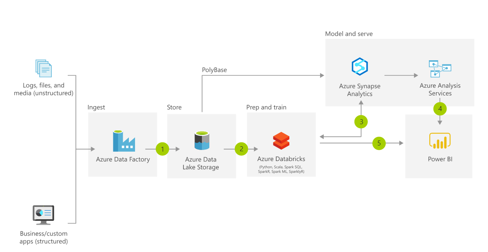

# Intrastructure as a code : Bicep - Azure Data Platforms

In this chapter, we are going to deploy Azure Data Platforms by Bicep. Infrastructure automation reduces redundant manipulations, this code can deploy all data platforms in approx 3 mins.

- What is Bicep?

Bicep is a domain-specific language (DSL) that uses declarative syntax to deploy Azure resources. 

Under the hood, Bicep (DSL) is converted into JSON which would be passed into Azure Resource Manager. 

- Bicep (DSL) -> JSON -> Azure Resource Manager -> Azure

# Azure Data services overview

Microsoft Azure offers services for a wide variety of data-related needs. 

- Data factory: Data pipelines. Integration of data sources, ETL, and data flows
- Synapse Analytics: Data lake and Datawarhouse platform. T-SQL Polybase and Spark
- Databricks: PySpark-based cloud service
- Purview: Data Governance solution to track and monitor, an overview of data lineage
- Azure HDInsight: an open-source analytics service that runs Hadoop, Spark, Kafka, and more (Most of cases, HDInsight can be replaced by the other azure services)

# Databricks vs Synapse Analytics

Synapse has an open-source Spark version with built-in support for . NET, whereas Databricks has an optimized version of Spark which offers increased performance.

https://adatis.co.uk/databricks-vs-synapse-spark-pools-what-when-and-where/

| Azure             | AWS               | GCP               |
|-------------------|-------------------|-------------------|
| Data factory      | Glue              | Cloud DataPrep    |
| Synapse Analytics | Redshift          | BigQuery          |
| Databricks        | Databricks on AWS | Databricks on GCP |
| Purview           | -                 | -                 |

# Azure DL/DW model architecutre 

 

 https://docs.microsoft.com/en-in/azure/architecture/solution-ideas/articles/enterprise-data-warehouse

# Bicep structure

```
project
│   README.md
│   init.ps1    
│   main.bicep
└───img
│   └───...
└───template
    │   databricks.bicep
    │   datafactory.bicep
    │   purview.bicep
    └── synapse.bicep
```

```powershell
PS> az group create --name $resourceGroup --location $location
PS> az deployment group create --resource-group $resourceGroup --template-file .\main.bicep --parameters .\deploy.parameter.json
```

# How to execute the script

- Execution flow

```cmd
.\init.ps1 -resourceGroup bicepRG -location japaneast
```

init.ps1 --> main.bicep --> execute in sequence `bicep` files in template directory

- init.ps1: Pass parameters and biceps to Azure CLI
- main.bicep: Consolidate the bicep files and control modules dependencies 
- template/<service_name>.bicep: Define Each service's specifications

# References

- [Bicep overview](https://docs.microsoft.com/en-us/azure/azure-resource-manager/bicep/overview?tabs=bicep)

- [Bicep CLI](https://docs.microsoft.com/en-us/azure/azure-resource-manager/bicep/deploy-cli)

- [Azure Bicep/ARM template](https://docs.microsoft.com/en-us/azure/templates/)

## Bicep Anti pattern - dependsOn syntax

```
resource dnsZone 'Microsoft.Network/dnszones@2018-05-01' = {
  name: 'demoeZone1'
  location: 'global'
}

resource otherZone 'Microsoft.Network/dnszones@2018-05-01' = {
  name: 'demoZone2'
  location: 'global'
  dependsOn: [
    dnsZone
  ]
}
```

Azure Resource Manager evaluates the dependencies between resources, and deploys them in their dependent order. When resources aren't dependent on each other, Resource Manager deploys them in parallel.

The use case for dependsOn is if you need to make sure that the Resource Manager will create the resource with the dependOn only after the other resource has been created (and not in parallel).

https://stackoverflow.com/questions/71320257/why-is-dependson-not-recommended-in-bicep
